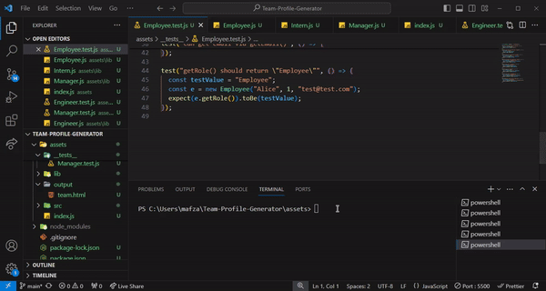

# Team-Profile-Generator

# Descrtiptio:

An application which takes an information about employees and generates team profile

# Instructions to use the application:

The appliaction runs by typing node index.js command in command line.
When command line opens up a message appears"Plesae build your team"
By hitting Enter another first question appears "What is your manager's name?"
On answeering series of questions about adding manager's, engineer's and Inter's details such as name, id,email,github username it creates html file with all the answers typed in the command line.
on opening the html file in the browser it shows all the employees data on the differend cards.

# Installation:

-inquirer@6.5.0
-jest

# Tests:

# A sample HTML file submitted

# A walkthrough video demonstrating the functionality of the application.

# URL of github repository!

https://github.com/AlmasMansuri/Team-Profile-Generator
